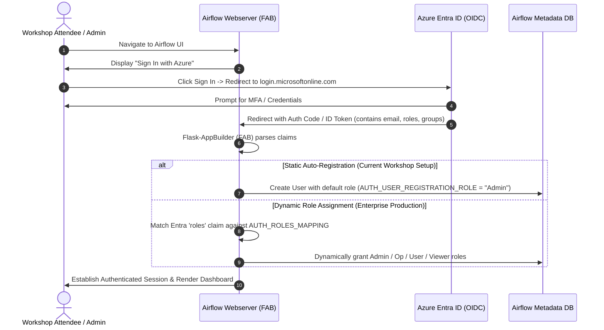

# Master Walkthrough & Technical Reference (AKS / Kubernetes)

This runbook provides the step-by-step verification commands, architectural deep dives, and troubleshooting procedures for running the Apache Airflow workshop on Azure Kubernetes Service (AKS).

---

## 📋 Table of Contents

1. [Cluster Context & Namespace Verification](#1-cluster-context--namespace-verification)
2. [Module 01: Airflow Deployment & Ingress Checks](#2-module-01-airflow-deployment--ingress-checks)
3. [Module 02: IoT Telemetry Workload Checks](#3-module-02-iot-telemetry-workload-checks)
4. [Module 05: Git-Sync Automated DAG Retrieval Checks](#4-module-05-git-sync-automated-dag-retrieval-checks)
5. [End-to-End Live Workshop Showcase](#5-end-to-end-live-workshop-showcase)
6. [Deep Dive 1: Where Airflow Pods Read DAGs (`/opt/airflow/dags`)](#6-deep-dive-1-where-airflow-pods-read-dags-optairflowdags)
7. [Deep Dive 2: Azure Entra ID SSO & Dynamic Role Assignment](#7-deep-dive-2-azure-entra-id-sso--dynamic-role-assignment)
8. [Deep Dive 3: Module 05 Troubleshooting Guide (Why DAGs Were Missing)](#8-deep-dive-3-module-05-troubleshooting-guide-why-dags-were-missing)

---

## 1. Cluster Context & Namespace Verification

```bash
# Verify current Kubernetes cluster context
kubectl config current-context

# Ensure namespace exists
kubectl get ns airflow
```

---

## 2. Module 01: Airflow Deployment & Ingress Checks

Deploy Airflow via Helm:
```bash
helm upgrade --install airflow apache-airflow/airflow \
  -n airflow \
  -f 01_install/values-airflow.yaml
```

Verify Airflow core pods and services:
```bash
kubectl get pods -n airflow
kubectl get svc -n airflow
```

**Expected Results:**
- `airflow-webserver-xxx`: Running & Ready (`1/1`)
- `airflow-scheduler-xxx`: Running & Ready (`1/1` or `2/2` with git-sync)
- `airflow-postgresql-0`: Running & Ready (`1/1`)
- `airflow-webserver` Service: Type `LoadBalancer` with an assigned `EXTERNAL-IP`

---

## 3. Module 02: IoT Telemetry Workload Checks

Deploy the PostgreSQL target database, Flask API backend, and dashboard:
```bash
kubectl apply -n airflow -f 02_usecase_etl/k8s/
```

Verify workload health:
```bash
kubectl get pods -n airflow -l 'app in (iot-telemetry-db, iot-api, airflow-dashboard)'
kubectl get svc -n airflow | grep -E "iot-api|airflow-dashboard|iot-telemetry-db"
```

Start local port-forwarding tunnels (in separate terminal windows):
```bash
kubectl port-forward -n airflow svc/airflow-dashboard 8081:80
kubectl port-forward -n airflow svc/iot-api 5000:5000
kubectl port-forward -n airflow svc/iot-telemetry-db 5433:5432
```

Test API connectivity:
```bash
curl -sS http://localhost:5000/api/health
curl -sS http://localhost:5000/api/stats
```

---

## 4. Module 05: Git-Sync Automated DAG Retrieval Checks

Deploy the Git-Sync overlay to enable automatic DAG synchronization:
```bash
helm upgrade --install airflow apache-airflow/airflow \
  -n airflow \
  -f 01_install/values-airflow.yaml \
  -f 05_git_based_dag_retrieval/values-git-sync.yaml
```

Verify git-sync sidecar container operations:
```bash
# 1. Check git-sync container sync logs
kubectl logs -n airflow deploy/airflow-scheduler -c git-sync --tail=50

# 2. Inspect DAG files in the scheduler pod
kubectl exec -n airflow deploy/airflow-scheduler -c scheduler -- ls -la /opt/airflow/dags

# 3. Check for any DAG import errors
kubectl exec -n airflow deploy/airflow-scheduler -c scheduler -- airflow dags list-import-errors

# 4. List all active DAGs registered in Airflow
kubectl exec -n airflow deploy/airflow-scheduler -c scheduler -- airflow dags list
```

---

## 5. End-to-End Live Workshop Showcase

1. **Open Dashboard:** Navigate to `http://localhost:8081/?api=http://localhost:5000`
2. **Inject Telemetry Data:**
   ```bash
   cd 02_usecase_etl
   python add_sensor_data.py --anomaly
   ```
   *(Observe: Dashboard "Unprocessed Readings" counter increases, raw logs show unprocessed entries)*
3. **Trigger Pipeline:** In Airflow UI, trigger DAG `iot_telemetry_etl`
   *(Observe: Metrics cards aggregate, chart draws temperature curves with 75°C threshold, alert cards fire)*
4. **Trigger Maintenance Classifier:** In Airflow UI, trigger DAG `manual_sensor_maintenance_classifier`
   *(Observe: Maintenance Queue table populates with CRITICAL/HIGH priority tickets)*

---

## 6. Deep Dive 1: Where Airflow Pods Read DAGs (`/opt/airflow/dags`)

### Pod Filesystem Location
In all standard Apache Airflow container images and Helm charts, the default directory where Airflow looks for DAG definitions is:

$$\mathbf{/opt/airflow/dags}$$

This is governed by the core configuration setting `AIRFLOW__CORE__DAGS_FOLDER=/opt/airflow/dags` (or `[core] dags_folder` in `airflow.cfg`).

### How Git-Sync Mounts DAGs
When `dags.gitSync.enabled: true` is enabled in Helm:
1. Kubernetes attaches a shared `emptyDir` volume (`dags`) to both the `git-sync` sidecar container and the `scheduler`/`webserver` containers.
2. The `git-sync` sidecar clones the Git repository into `/git/` inside the volume and periodically pulls updates (`wait: 30`).
3. If `subPath` is specified in `values-git-sync.yaml`:
   ```yaml
   dags:
     gitSync:
       subPath: "airflow/k8s_version/05_git_based_dag_retrieval/dags"
   ```
   Kubernetes volume mounts **only that specific subdirectory** directly into `/opt/airflow/dags` in the Airflow container.
4. **Airflow Architecture Note:** In Airflow 2.x+, the **Scheduler** reads `/opt/airflow/dags`, compiles the DAG Python code, and writes the serialized representation into the metadata database (`serialized_dag` table). The **Webserver** reads DAG structures directly from the database, ensuring high UI responsiveness without local code execution risks.

---

## 7. Deep Dive 2: Azure Entra ID SSO & Dynamic Role Assignment

### Authentication Workflow (OIDC / OAuth 2.0)



### Static Auto-Registration vs Dynamic Role Assignment

#### 1. Static Auto-Registration (Workshop Mode)
In `01_install/values-airflow.yaml`:
```python
AUTH_TYPE = AUTH_OAUTH
AUTH_USER_REGISTRATION = True
AUTH_USER_REGISTRATION_ROLE = "Admin"
AUTH_ROLES_SYNC_AT_LOGIN = False
```
- Every user authenticated via Entra ID is automatically registered and assigned the `Admin` role.
- Ideal for workshop participants where full access is needed without configuring complex Azure directory permissions.

#### 2. Dynamic Role Assignment from Azure Entra ID (Enterprise Production)
In enterprise environments, permissions must match the user's role in Azure Entra ID.

**Step A: Configure App Roles in Azure Portal:**
1. In **Azure Entra ID** > **App Registrations** > Select your Airflow App.
2. Under **App Roles** > Create App Roles matching your team structure:
   - `Airflow.Admin` (Allowed member types: Users/Groups)
   - `Airflow.Op`
   - `Airflow.User`
   - `Airflow.Viewer`
3. Under **Enterprise Applications** > Assign users or security groups to these App Roles.

**Step B: Configure Dynamic Role Sync in `values-airflow.yaml`:**
Update `webserver.webserverConfig`:
```python
AUTH_TYPE = AUTH_OAUTH
AUTH_USER_REGISTRATION = True
AUTH_USER_REGISTRATION_ROLE = "Public"  # Default if no roles match
AUTH_ROLES_SYNC_AT_LOGIN = True        # <-- Dynamically update on every login

AUTH_ROLES_MAPPING = {
    "Airflow.Admin": ["Admin"],
    "Airflow.Op": ["Op"],
    "Airflow.User": ["User"],
    "Airflow.Viewer": ["Viewer"],
    # You can also map Azure AD Security Group Object IDs directly:
    # "b3f2c5d1-1234-5678-9abc-def012345678": ["Admin"],
}
```
Whenever a user logs in, FAB checks the `roles` (or `groups`) array in the Azure token, maps them against `AUTH_ROLES_MAPPING`, and updates the user's Airflow permissions dynamically.

---

## 8. Deep Dive 3: Module 05 Troubleshooting Guide (Why DAGs Were Missing)

If Module 05 is deployed but DAGs do not appear in the Airflow UI or CLI, follow this diagnostic checklist:

```text
                                Diagnostic Checklist
                                         │
        ┌────────────────────────────────┴────────────────────────────────┐
        ▼                                                                 ▼
[ 1. Check Git-Sync Sidecar ]                                   [ 2. Inspect /opt/airflow/dags ]
kubectl logs deploy/airflow-scheduler -c git-sync               kubectl exec deploy/airflow-scheduler -c scheduler -- ls -la /opt/airflow/dags
  - Clone failed? -> Check repo URL & SSH secret                  - Empty? -> subPath mismatch in values-git-sync.yaml
  - Rate limited? -> Increase sync wait interval                  - Files present? -> Proceed to step 3
        │                                                                 │
        └────────────────────────────────┬────────────────────────────────┘
                                         ▼
                        [ 3. Check DAG Import Errors ]
                        kubectl exec deploy/airflow-scheduler -c scheduler -- airflow dags list-import-errors
                          - Syntax/Import error? -> Fix Python code/provider dependencies
                          - No errors & files exist? -> Wait 30s for scheduler parsing loop
```

### Diagnostic Command Reference

| Check | Command | Healthy Indicator |
| :--- | :--- | :--- |
| **Git-Sync Logs** | `kubectl logs -n airflow deploy/airflow-scheduler -c git-sync --tail=50` | `level=info msg="sync complete"` |
| **Pod DAG Folder** | `kubectl exec -n airflow deploy/airflow-scheduler -c scheduler -- ls -la /opt/airflow/dags` | Lists `minimal_etl.py` and `manual_sensor_cleaning_dag.py` |
| **DAG Import Errors** | `kubectl exec -n airflow deploy/airflow-scheduler -c scheduler -- airflow dags list-import-errors` | `No data found` |
| **Registered DAGs** | `kubectl exec -n airflow deploy/airflow-scheduler -c scheduler -- airflow dags list` | Lists `iot_telemetry_etl` and `manual_sensor_maintenance_classifier` |
